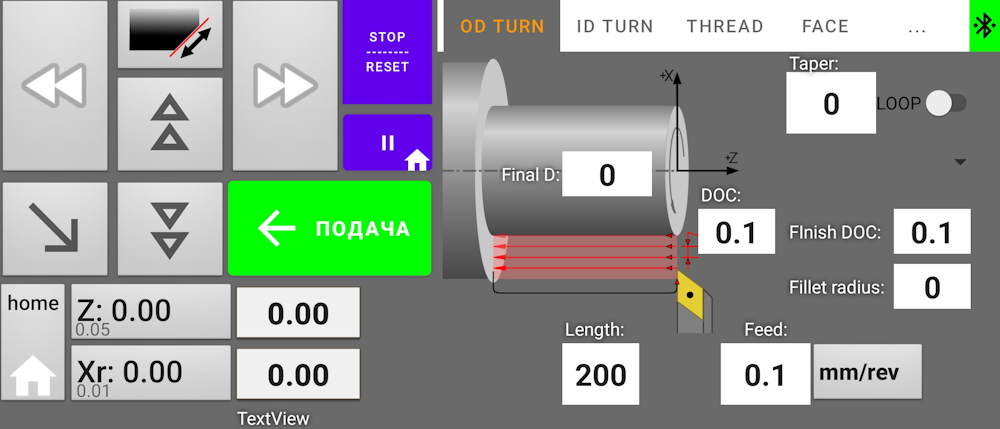

Android remote controller appilcation for CNC lathe EFEED controller, based on SMT32F1 controller
======
Support threading, inside and outside turning, face turning, Gcode based controlling for custom shapes turning

